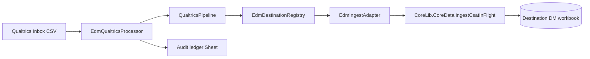

# External Data Manager (EDM)

Standalone Google Apps Script project for shared **external-data orchestration** (Qualtrics first, Capacity later). Lives at `solutions/External_Data_Manager`.

## V1B scope (current)

| In scope | Out of scope (until authorized) |
|----------|----------------------------------|
| Drive folder setup (idempotent) under `External Data/Qualtrics/Inbox` + `Failed` | Real Qualtrics ingest into HC/SLG/HENP production workbooks |
| Destination registry (logical `HC_DM` / `SLG_DM` / `HENP_DM` → Script Properties) | DepMngr CoreLib version cut / consumer pin changes |
| `processQualtricsInboxNow` + `runQualtricsInboxScheduled` (trigger **not installed**) | Scheduled trigger installation |
| Dry-run default (`dryRun: true`) | Deleting successful Inbox sources (default **off**) |
| Sheet-backed job audit ledger (counts/metadata only) | Production DM deployment |
| CoreLib **144** immutable pin (`developmentMode: false`) | First real Qualtrics ingest (explicit authorization) |

**V1A** remains: local normalize/route tests, `EdmOrchestrator.processQualtricsCsvJob` (stops at `READY_FOR_INGESTION`).

**V1 operations:** [edm-qualtrics-v1-runbook.md](./edm-qualtrics-v1-runbook.md)

## Architecture decision: EDM → DepMngr



- **EDM** owns orchestration, Drive, checksum/duplicate/stale guards, locking, audit, routing config.
- **DepMngr** owns tenant/deployment-universe filtering and `CSAT_InFlight` replacement (`ingestCsatInFlight`).
- **Manual UI** still calls `uploadCsatInFlightCsvForUI` → parse CSV → same canonical ingest path.
- **Library pin:** EDM uses immutable CoreLib **144** (`developmentMode: false`) with `ingestCsatInFlight` on the executing library version.

## Routing (authoritative)

- Qualtrics `Sub Region` → normalized `app`
- `US Healthcare` → **healthcare** population → **HC_DM**
- `US SLED` → **sled** population → **SLG_DM** + **HENP_DM** (same rows; DepMngr filters per workbook)

Healthcare is not routed to HENP. Routing lives in `QualtricsRoutingConfig`, not the normalizer.

## Script Properties

| Property | Purpose |
|----------|---------|
| `EXTERNAL_DATA_PARENT_FOLDER_ID` | Parent `External Data` Drive folder |
| `QUALTRICS_INBOX_FOLDER_ID` | Inbox drop folder |
| `QUALTRICS_FAILED_FOLDER_ID` | Failed source retention |
| `EDM_AUDIT_LEDGER_SPREADSHEET_ID` | Job ledger spreadsheet |
| `EDM_DEST_HC_DM_SPREADSHEET_ID` | HC workbook id |
| `EDM_DEST_SLG_DM_SPREADSHEET_ID` | SLG workbook id |
| `EDM_DEST_HENP_DM_SPREADSHEET_ID` | HENP workbook id |
| `EDM_QUALTRICS_INGEST_ENABLED` | Must be `true` for non–dry-run ingest |
| `EDM_DELETE_SUCCESSFUL_QUALTRICS_SOURCE` | Must be `true` to delete Inbox file after full success |

Never commit property **values** or `.clasp.json`.

### One-time setup (GAS editor or API)

1. `EdmSetup.setupQualtricsDriveFolders('<parent External Data folder id>')`
2. `EdmSetup.ensureAuditLedger()`
3. Resolve destination spreadsheet IDs (read-only):  
   `python solutions/External_Data_Manager/scripts/resolve-edm-destinations.py`  
   then `EdmSetup.setDestinationSpreadsheetId('HC_DM', '...')` (etc.)

### Remote GAS project

Create standalone project: `cd solutions/External_Data_Manager && clasp create --type standalone --title "External Data Manager"`  
Add gitignored `.clasp.json`, then `npm run push` after local tests pass.

## Process Now / dry-run

```javascript
// Default: dry-run (no workbook mutation, no delete)
processQualtricsInboxNow({ dryRun: true });

// Controlled validation on Drive (still no ingest unless enabled)
processQualtricsInboxNow({ dryRun: false, ingestEnabled: false });
```

Future trigger calls the same processor: `runQualtricsInboxScheduled()` — **do not install** until operations sign-off.

## Duplicate / stale / concurrency

- Script lock: `EdmLocking.QUALTRICS_INGEST_LOCK_KEY`
- Duplicate successful checksum → reject (`DUPLICATE_SUCCESS_CHECKSUM`); override via `allowDuplicateOverride` (audited).
- Stale export timestamp → reject when a newer successful job exists; override via `allowStaleOverride`.
- Without trustworthy export timestamp, stale guard does not use Drive upload time.

## Retry (partial failure)

Ingest is **replacement-based** per destination. On `PARTIAL_FAILURE`, retry with `processQualtricsInboxNow({ retryDestinationAppIds: ['HENP_DM'], ... })` (planned) or re-run full job when all destinations are idempotent-safe. Ledger stores per-destination status in `destination_statuses`.

## Source deletion invariant

Deletion requires: validation + transform + **all** destination ingestions + verification + audit persist.  
Default: `deleteSuccessfulSource` false and `EDM_DELETE_SUCCESSFUL_QUALTRICS_SOURCE` unset/false.

## Safer CSAT_InFlight (DepMngr)

`CoreData.ingestCsatInFlight` / `_replaceCsatInFlightSafely_`:

1. Build full payload in memory  
2. Document lock  
3. Single `setValues` for header + rows; clear trailing rows only  
4. Verify headers/row count; restore prior range on failure  
5. Clear caches only after success  

Optional explicit `context.spreadsheetId` for EDM; container UI uses active spreadsheet.

## Local tests

```powershell
cd solutions/External_Data_Manager
npm test
node scripts/validate-qualtrics-csv.js "<absolute-path-to-export.csv>"

cd libraries/DepMngr
npm test

python skills/gas-monorepo-engineer/scripts/preview_selftest.py
```

## Production authorization boundary

Code/infrastructure setup (EDM project, folders, ledger, properties, dry-run) is separate from **first real Qualtrics ingest** into HC/SLG/HENP. The latter requires explicit authorization after review.

## Related analysis

- [Qualtrics discovery index](../analysis/external-data/qualtrics/README.md)
- [Ingestion contract](../analysis/external-data/qualtrics/ingestion-contract.md)
- [DM family](../analysis/dm-family/README.md)
