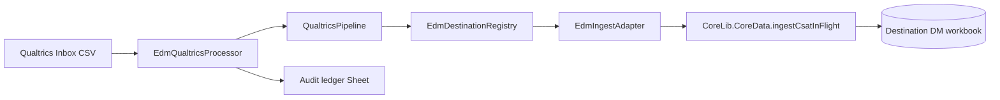

# External Data Manager (EDM)

Standalone Google Apps Script project for shared **external-data orchestration** (Qualtrics V1 production active). Lives at `solutions/External_Data_Manager`.

## Qualtrics V1 (production)

| Component | State |
|-----------|--------|
| CoreLib pin (EDM) | **145** immutable |
| DM destinations (HC / SLG / HENP) | CoreLib **144** |
| EVI / PDX / HS | CoreLib **139** (not Qualtrics destinations) |
| Ingest | `EDM_QUALTRICS_INGEST_ENABLED=true` (normal ops) |
| Successful-source delete | `EDM_DELETE_SUCCESSFUL_QUALTRICS_SOURCE=true` |
| Schedule | One trigger: `runQualtricsInboxScheduled` (~15 min) |
| User workflow | Drop full-dashboard Qualtrics CSV in Drive **Qualtrics → Inbox** |

**Operations runbook:** [edm-qualtrics-v1-runbook.md](./edm-qualtrics-v1-runbook.md)

**One-time activation (after first verified ingest):** run `runEdmQualtricsV1ProductionActivationNow()` in the EDM Apps Script project (sets properties, idempotent trigger, verified source cleanup, empty-Inbox no-op).

## Architecture decision: EDM → DepMngr



- **EDM** owns orchestration, Drive, checksum/duplicate/stale guards, locking, audit, routing config.
- **DepMngr** owns tenant/deployment-universe filtering and `CSAT_InFlight` replacement (`ingestCsatInFlight`).
- **Manual UI** still calls `uploadCsatInFlightCsvForUI` → parse CSV → same canonical ingest path (emergency fallback).
- **Library pin:** EDM **145**; destination DMs **144** for Qualtrics CSAT path.

## Routing (authoritative)

- Qualtrics `Sub Region` → normalized `app`
- `US Healthcare` → **healthcare** population → **HC_DM**
- `US SLED` → **sled** population → **SLG_DM** + **HENP_DM** (same rows; DepMngr filters per workbook)

Healthcare is not routed to HENP. Routing lives in `QualtricsRoutingConfig`, not the normalizer.

## Script Properties

| Property | Purpose |
|----------|---------|
| `EXTERNAL_DATA_PARENT_FOLDER_ID` | Parent `External Data` Drive folder |
| `QUALTRICS_INBOX_FOLDER_ID` | Inbox drop folder |
| `QUALTRICS_FAILED_FOLDER_ID` | Failed source retention |
| `EDM_AUDIT_LEDGER_SPREADSHEET_ID` | Job ledger spreadsheet |
| `EDM_DEST_HC_DM_SPREADSHEET_ID` | HC workbook id |
| `EDM_DEST_SLG_DM_SPREADSHEET_ID` | SLG workbook id |
| `EDM_DEST_HENP_DM_SPREADSHEET_ID` | HENP workbook id |
| `EDM_QUALTRICS_INGEST_ENABLED` | Must be `true` for non–dry-run ingest |
| `EDM_DELETE_SUCCESSFUL_QUALTRICS_SOURCE` | Must be `true` to delete Inbox file after full success |

Never commit property **values** or `.clasp.json`.

## Process Now / scheduled

```javascript
// Same processor as the production trigger (default dry-run when called manually without ingest flag)
processQualtricsInboxNow({ dryRun: true });

// Production trigger entry (installed once at V1 activation)
runQualtricsInboxScheduled();
```

## Duplicate / stale / concurrency

- Script lock: `EdmLocking.QUALTRICS_INGEST_LOCK_KEY`
- Duplicate successful checksum → reject (`DUPLICATE_SUCCESS_CHECKSUM`); source stays in Inbox (not moved to Failed).
- Stale export timestamp → reject when a newer successful job exists; override via `allowStaleOverride`.
- Without trustworthy export timestamp, stale guard does not use Drive upload time.

## Successful-source deletion (production)

Deletion requires explicit `EDM_DELETE_SUCCESSFUL_QUALTRICS_SOURCE=true` **and** processor flag on the run. `EdmDriveFolders.sourceDeletionPolicy()` documents: transform success, all intended ingestions success, verification success, audit persistence — enforced via `computeDeleteAllowed_` on **SUCCESS** jobs only.

## Retry (partial failure)

Pass `retryDestinationAppIds` to re-ingest only failed destinations without re-transforming (orchestrator support).

## Local validation

```powershell
node solutions/External_Data_Manager/scripts/validate-qualtrics-csv.js "C:\path\to\export.csv"
cd solutions/External_Data_Manager; npm test
```

## Related analysis

- [docs/analysis/external-data/qualtrics/](../analysis/external-data/qualtrics/README.md)
