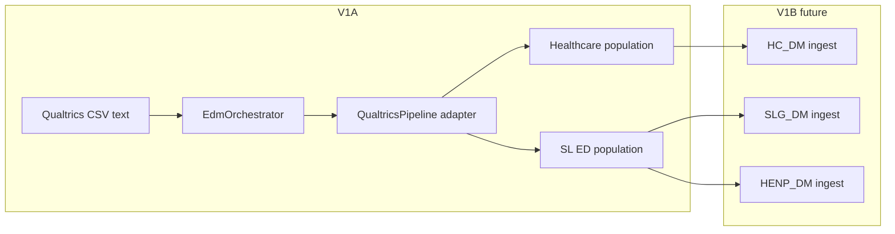

# External Data Manager (EDM)

Standalone Google Apps Script project for shared **external-data orchestration** (Qualtrics first, Capacity later). Lives at `solutions/External_Data_Manager`.

## V1A scope (current)

| In scope | Out of scope (V1B+) |
|----------|---------------------|
| Job model, checksum, duplicate/stale guards, locking design | Production Drive folders |
| Qualtrics CSV parse → validate → normalize → dedupe → route | Inbox polling / triggers |
| Orchestrator stopping at `READY_FOR_INGESTION` | `clasp push`, deploy, remote GAS project |
| Node tests + Python test oracle | HC/SLG/HENP workbook writes |
| Design docs for audit ledger, Drive layout, deletion invariant | `ingestCsatInFlight` refactor in DepMngr |

**Remote GAS:** V1A is **local only**. Before CLASP push, create a standalone Apps Script project (`clasp create --type standalone`), add local `.clasp.json` (gitignored), and set Script Properties when Drive is ready.

## Architecture



**Routing (authoritative):**

- Qualtrics `Sub Region` → normalized `app`
- `US Healthcare` → **Healthcare** population → **HC_DM** at ingest
- `US SLED` → **SLED** population → **SLG_DM** and **HENP_DM** (same normalized rows; DepMngr tenant filter per workbook)

Do not route Healthcare to HENP.

## Key modules

| Area | Files |
|------|--------|
| Job lifecycle | `EdmJobTypes.js`, `EdmJob.js`, `EdmOrchestrator.js` |
| Integrity | `EdmChecksum.js`, `EdmDuplicateGuard.js`, `EdmLocking.js` |
| Drive (config only) | `EdmDriveFolders.js` |
| Audit design | `EdmAuditLedger.js` |
| Qualtrics | `src/qualtrics/*` |

## Script Properties (future)

| Property | Purpose |
|----------|---------|
| `QUALTRICS_PARENT_FOLDER_ID` | Parent Qualtrics folder |
| `QUALTRICS_INBOX_FOLDER_ID` | Inbox drop folder |
| `QUALTRICS_FAILED_FOLDER_ID` | Failed source retention |

`EdmDriveFolders.ensureQualtricsChildFolders` locates/creates **Inbox** and **Failed** under the parent. No default Archive; successful sources are **deleted** only after full ingest + verify + audit (see below).

## Source file deletion invariant

A Qualtrics source file must **not** be deleted because transformation alone succeeded. Deletion requires:

1. Transform success  
2. All intended destination ingestions success  
3. Verification success  
4. Job audit record persisted  

V1A does not delete any Drive files.

## Duplicate / stale protection

- **Checksum:** SHA-256 of source CSV text (`EdmChecksum`).
- **Duplicate success:** same checksum as a prior `SUCCESS` job → reject (`DUPLICATE_SUCCESS_CHECKSUM`).
- **Stale export:** if a reliable `exportTimestamp` is provided and is older than a newer successful job → reject (`STALE_AFTER_NEWER_SUCCESS`).
- **Qualtrics CSV limitation:** exports may not include a trustworthy export timestamp; do not rely on Drive upload time alone when a source timestamp exists.

## Locking

`EdmLocking.QUALTRICS_INGEST_LOCK_KEY` — future `LockService` around workbook mutations so scheduled runs and “Process Now” cannot race.

## Audit ledger (V1B)

Proposed: small Google Sheet owned by EDM with columns in `EdmAuditLedger.LEDGER_HEADERS` (job id, pipeline, checksum, counts, destination statuses, sanitized errors). No PII row payloads.

## Canonical ingest boundary (V1B)

Today: `CoreData.uploadCsatInFlightCsvForUI(config, csvText)` (parse + tenant filter + sheet replace + backup + cache).

Target:

- `ingestCsatInFlight(config, normalizedRows, metadata)` — shared by manual UI and EDM.
- `acquireSpreadsheet(config)` or explicit spreadsheet id for non–container-bound orchestrator.

## Safer CSAT_InFlight replacement (design)

Recommended V1B approach:

1. Parse and validate entire payload in memory.  
2. Acquire ingest lock.  
3. Map rows to storage schema; tenant-filter.  
4. Write to a **staging** range or sheet tab (or hold a single `setValues` payload).  
5. Verify row/header counts on staging.  
6. Replace `CSAT_InFlight` in one `setValues` (or swap staging → primary).  
7. Backup raw CSV to Drive (existing pattern).  
8. Clear caches only after successful write.  
9. On failure, leave prior `CSAT_InFlight` untouched.

Avoid clear-then-write without a verified replacement buffer (current risk).

## Triggers (design)

- Time-driven: scan Inbox on schedule.  
- Manual: `processQualtricsInboxNow()` (same processor).  
- V1A: neither installed.

## Notifications (V1B+)

Replaceable status surface: success / failed / per-destination failure + user action (e.g. check Failed folder). No production email in V1A.

## Capacity reuse

Generic: job states, checksum, duplicate guard, locking keys pattern, orchestrator shape, audit row mapping. Add a `CapacityPipeline` adapter with its own validator/transformer; do not embed Qualtrics rules in `EdmJob*`.

## Local tests

```powershell
cd solutions/External_Data_Manager
node test/fixtures/build-synthetic-fixture.js   # optional regenerate
npm test
```

Python equivalence uses `test/oracle/normalize_qualtrics_oracle.py` (pandas; CSV input). Behavioral reference: external `Qualtrics.py` (not in monorepo).

## Related analysis

- [Qualtrics discovery index](../analysis/external-data/qualtrics/README.md)
- [DM family](../analysis/dm-family/README.md)
