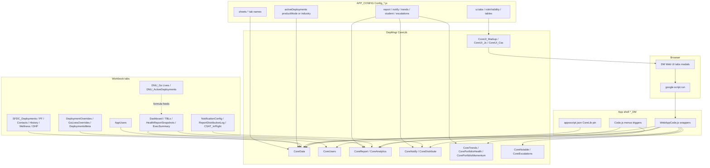

# Cross-layer dependency graph

Edges show primary data/control flow (not every diagnostic or menu entry).

## Layer contracts

| From | To | Contract |
|------|-----|----------|
| Workbook | `APP_CONFIG.sheets` | Literal tab names; wrong name → empty maps (often silent) |
| `APP_CONFIG` | CoreData | `activeDeployments.*` defines portfolio membership (Mechanism A) |
| `APP_CONFIG` | CoreUI | `ui.*` defines visible tabs/columns/modals |
| CoreUI_Js | WebAppCode | Curated `google.script.run.*` methods (see contracts doc) |
| WebAppCode | CoreLib | `CoreLib.<Module>.<fn>(APP_CONFIG, …)` |
| Named ranges | CoreReport | `HealthTotal`, `RedYellow`, etc. on `Dashboard` / `RedYellow_TBL` |

## Mode split (intentional)

| Apps | Mode | Config block |
|------|------|----------------|
| SLG, HC, HENP | IndustryMode-style | `activeDeployments` status/industry filters + union rules |
| EVI, HS, PDX | ProductMode | `activeDeployments.productMode*` + optional `ui.productFilter` |

HENP adds **Student** workbook tab + `student.enabled` UI tab.

PDX adds **Escalations** sheets + `getEscalationsDashboardData`.

## Preview/local dev gap

`preview_engine.py` inlines DepMngr UI strings but **does not** execute CoreData. Interactive tabs require mock `google.script.run` handlers returning shapes documented in [google-script-run-contracts.md](./google-script-run-contracts.md).
