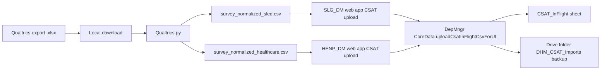

# Current Qualtrics workflow (as discovered)

## End-to-end (manual)

## Steps in detail

1. **Qualtrics export** — Single workbook export (`.xlsx`), first sheet, row-oriented distribution/contact data. Jeff runs weekly (per Python header comment).
2. **Local Python** — `python Qualtrics.py <raw_export.xlsx>` from `Documents\PY` (outside Git). Produces two CSVs in the working directory.
3. **Per-app upload** — In each Deployment Manager web app, CSAT tab → File Upload sub-tab → drop **`survey_normalized_*.csv`** (UI copy references `survey_normalized_*.csv`).
4. **Apps Script** — Browser `FileReader.readAsText` sends full CSV string to `uploadCsatInFlightCsvForUI` on the **container-bound** script for that workbook.
5. **Post-ingest** — UI reloads CSAT tab; freshness string references “Qualtrics data freshness” from script property `CSAT_LAST_IMPORT:<appId>`.

## What is *not* in the monorepo today

- The Qualtrics Python transformer is **not** tracked in `C:\JD`.
- Sample output CSV headers exist locally under `Documents\PY` (not committed).
- No Drive inbox, job queue, or automated orchestration in repo.

## Application mapping (operational)

| Python output file | Qualtrics `app` (`Sub Region`) | DM consumer (per initiative scope) |
|--------------------|--------------------------------|-------------------------------------|
| `survey_normalized_sled.csv` | `US SLED` | `SLG_DM` |
| `survey_normalized_healthcare.csv` | `US Healthcare` | `HENP_DM` (today; **not** `HC_DM`) |

`HC_DM` is out of scope for the current Qualtrics export (`VALID_APPS` in Python). Future HC support implies a third `app` value and routing config.

## Naming note

The UI and GAS comments say “Qualtrics” and “survey_normalized”; the Python file on disk is `Qualtrics.py` but its module comment names `qualtrics_normalize.py`.
