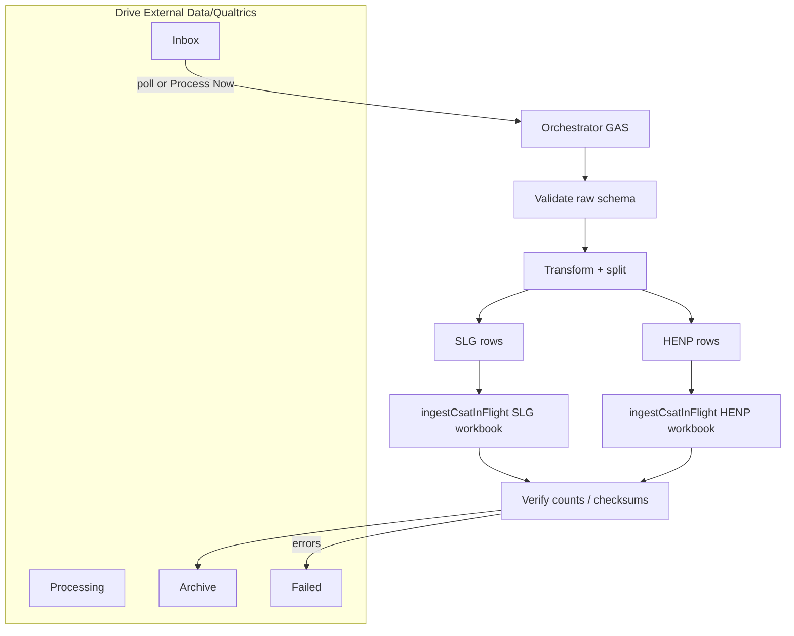

# Future architecture — Drive inbox & shared framework

## Recommended logical architecture



**Principle:** One transform implementation; one ingest implementation; UI and Drive both call ingest after transform.

## Job lifecycle (proposed)

| State | Meaning |
|-------|---------|
| `RECEIVED` | File landed in Inbox; job id + checksum recorded |
| `VALIDATING` | Schema / `app` domain checks |
| `TRANSFORMING` | Raw → normalized row sets |
| `INGESTING_SLG` | Writing SLG `CSAT_InFlight` |
| `INGESTING_HENP` | Writing HENP `CSAT_InFlight` |
| `VERIFYING` | Row counts, optional hash compare to transform output |
| `SUCCESS` | All enabled destinations OK |
| `PARTIAL_FAILURE` | One destination failed |
| `FAILED` | Validation/transform failed |
| `ARCHIVED` | Artifacts moved; Inbox copy retained read-only |

## Drive folder layout (proposed)

```
External Data/Qualtrics/Inbox/
External Data/Qualtrics/Processing/<jobId>/
External Data/Qualtrics/Archive/<jobId>/
External Data/Qualtrics/Failed/<jobId>/
```

**Retain per job:** original export (never overwrite), normalized CSVs per route, `job.json` (states, timestamps, actor, transform version, checksums, per-destination ingest results, validation report).

## Trigger / orchestration (Apps Script)

| Mechanism | Notes |
|-----------|--------|
| Time-driven poll | Scan Inbox folder on schedule; no native “on file created” trigger in GAS |
| `Process Now` | Menu or web hook in orchestrator project |
| Locks | `LockService` per job id; prevent double processing |
| Idempotency | Content checksum + “processed” marker file or property |
| Partial failure | Per-destination status; leave failed workbook unchanged or explicit rollback policy |
| Notifications | `MailApp` / Chat webhook with job summary (no PII in subject/body) |

**Spreadsheet context:** Ingest today uses `getActiveSpreadsheet()`. Options:

1. **Per-workbook triggers** — HENP/SLG bound scripts each ingest their slice (orchestrator drops CSV in Drive + calls `ScriptApp` API — needs careful auth).
2. **Refactor ingest** — pass `SpreadsheetApp.openById(id)` into CoreData (preferred for single orchestrator).
3. **SLG-hosted orchestrator** — mirror `DataFreshnessMonitorHost.js` pattern: script properties `FRESHNESS_SPREADSHEET_*` style ids for target workbooks; still needs ingest refactor to open by id.

## Python elimination assessment

| Option | Verdict |
|--------|---------|
| **A — GAS transform + ingest** | **Preferred** for this pipeline: logic is small; ops stay in Google; intermediate CSVs optional (in-memory split). |
| **B — GitHub Actions** | Only if corporate approves AND Qualtrics xlsx must stay without Drive conversion; adds Drive API auth, secrets, and dual runtime maintenance. |
| **C — Hosted Python / Cloud Run** | Not recommended without confirmed access; no repo evidence of usable environment. |

### GitHub Actions (if ever needed)

- Obtain file: Drive API download or manual artifact upload to workflow (awkward for “drop in folder” UX).
- Secrets: service account JSON (policy unknown).
- Return path: upload normalized CSVs to Processing/Archive folders; trigger GAS ingest via **installed trigger or editor** (not Execution API from CI—see [gas-runtime-execution.md](../../../../skills/gas-monorepo-engineer/references/gas-runtime-execution.md)).
- **Justification vs GAS:** bulk pandas on huge files, or banned Drive conversion — not demonstrated for current transform.

## Testing strategy (GAS transform migration)

1. Create **sanitized** raw export fixture (schema-realistic, no real PII) — store outside Git or in gitignored `fixtures/`.
2. Run Python → golden `sled.csv` / `healthcare.csv`.
3. Run GAS transform (or Node test harness sharing JS) → compare:
   - row counts per `app`
   - column order and headers
   - dedup keys
   - `tracking_status` / timestamps / `response_received`
4. Run both through `uploadCsatInFlightCsvForUI` in test workbooks (manual or future test harness).
5. Keep Python as **regression oracle** until parity proven across N weekly exports.

## Future HC routing (config sketch)

Follow monorepo config patterns (`config/apps.json` + per-pipeline JSON):

```javascript
// illustrative only
destinations: {
  SLG:  { enabled: true,  qualtricsApp: 'US SLED',       spreadsheetProp: 'QUALTRICS_SPREADSHEET_SLG' },
  HENP: { enabled: true,  qualtricsApp: 'US Healthcare', spreadsheetProp: 'QUALTRICS_SPREADSHEET_HENP' },
  HC:   { enabled: false, qualtricsApp: 'US Healthcare', spreadsheetProp: 'QUALTRICS_SPREADSHEET_HC' }
}
```

When HC joins the export, Qualtrics may need a **distinct** `Sub Region` value (avoid routing ambiguity with HENP).

## Reuse for SLG Capacity (framework only)

Shared **External Data Ingestion Framework** concepts:

- Drive Inbox / Processing / Archive / Failed
- Job id + checksum + state machine
- Validation reports + transform version stamp
- Locking, retry, partial failure
- Audit metadata without PII in logs
- **Canonical ingest interface** + **transform adapter** (Qualtrics vs Capacity WoW xlsx)
- Notification templates

Capacity-specific `transform.py` / `wow_transform.py` remain separate adapters; do not merge Qualtrics rules.

## Idempotency & concurrency (current behavior)

| Scenario | Class | Why |
|----------|-------|-----|
| Same SLG CSV uploaded twice | **SAFE** (functionally) | Full replace; same data → same sheet; backup filename may overwrite same day |
| Same HENP CSV twice | **SAFE** | Same |
| Same raw export transformed twice | **SAFE** if deterministic | Identical outputs |
| Older export after newer | **UNSAFE** | No version compare; older data replaces newer silently |
| SLG ok, HENP fail (manual) | **SAFE** | Independent workbooks |
| Ingest throws mid-write | **PARTIALLY_SAFE** | Clear-before-write can empty sheet |
| Concurrent uploads same app | **UNSAFE** | No lock; last writer wins |
| Concurrent Drive job + UI upload | **UNSAFE** | Same |

**Job system must add:** source file timestamp/checksum ordering, `LockService`, transactional write (write to staging sheet then swap), job-level audit.

## Security & data handling (categories)

Fields indicate presence of: customer/account names, deployment names, contact names/emails/roles, employee/EM names and emails, partner names, survey metadata, response ids, satisfaction/NPS scores (when populated), distribution channel metadata.

| Surface | Guidance |
|---------|----------|
| Drive Inbox/Archive | Restricted shared drive; no public links |
| Logs | Log counts and job ids only |
| Git | Schema docs only; no fixtures with PII in tracked files |
| `DHM_CSAT_Imports` | Treat as sensitive; lifecycle/retention policy needed |
| Transform hosting | Prefer GAS in same Workspace boundary |

## Open questions for Jeff

1. Confirm **HENP** ← `survey_normalized_healthcare.csv` / Qualtrics `US Healthcare` (vs future HC split).
2. Qualtrics export format: always **xlsx**, or acceptable to switch export to **CSV** to simplify GAS?
3. Corporate policy: **GitHub Actions** / service accounts for Drive — allowed or not?
4. Orchestrator placement: **standalone GAS project** vs **SLG-bound host** (like freshness monitor)?
5. Retention period for Archive vs `DHM_CSAT_Imports` backups.
6. When HC enables, will Qualtrics add a new `Sub Region` value distinct from HENP?
