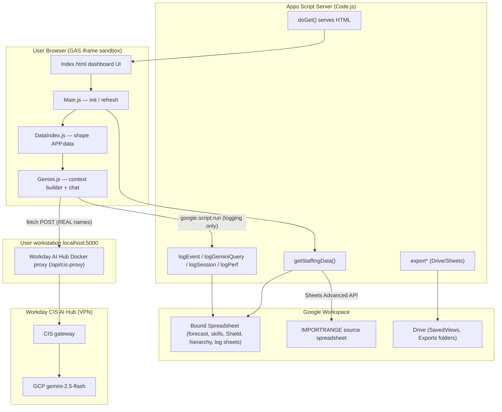
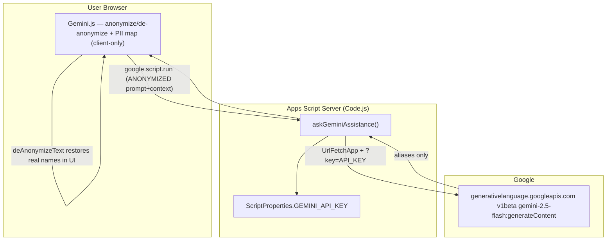
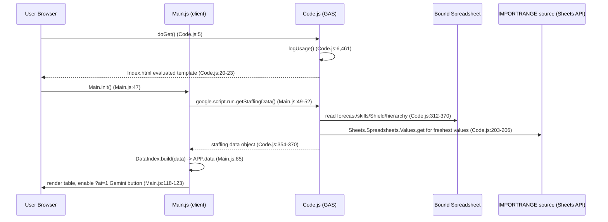
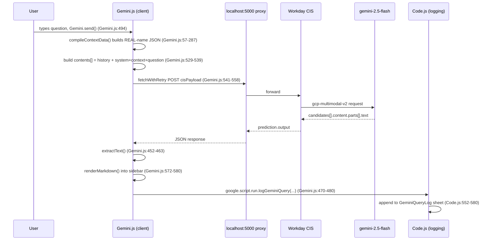

# ARCHITECTURE — forecastdashboard

> Read-only static review. No application code was modified, executed, deployed, or committed.
> Repository: `https://ghe.megaleo.com/lance-davis/forecastdashboard.git`
> Cloned to: `../forecastdashboard/` (sibling of this research folder)

**Label key used throughout:** `[VERIFIED]` = directly observed in code; `[INFERRED]` = reasonable deduction not fully proven by source; `[UNKNOWN]` = cannot be confirmed from repository contents.

---

## 1. Executive Summary

`forecastdashboard` is a **Google Apps Script (GAS) container-bound web app** that renders a consulting "Global Capacity" staffing/forecast dashboard from Google Sheets and layers a **Gemini AI "Resource Assistant"** on top. The app reads forecast, skills, utilization, and hierarchy data from the bound spreadsheet, shapes it in the browser, and lets a user ask natural-language staffing questions answered by Gemini 2.5 Flash.

The repository contains **multiple branches with two materially different Gemini integration designs** `[VERIFIED]`:

| Branch | Gemini call location | Endpoint | Auth | PII handling |
|--------|---------------------|----------|------|--------------|
| `main` | **GAS server-side** (`askGeminiAssistance`) | `generativelanguage.googleapis.com` (Gemini Developer API) | `GEMINI_API_KEY` Script Property | **Anonymized** (client alias map + de-anonymize) |
| `dev` / `feature/admin-interactive-tables` | **Browser client-side** (`fetch` to `localhost:5000`) | Workday CIS AI Hub proxy → GCP `gemini-2.5-flash` | Local proxy + VPN + feature-key header (no API key in code) | **Real names sent** (no anonymization) |

Because the checked-out default branch (`master`) contains only a README `[VERIFIED]`, this analysis focuses on **`dev`** as the current/most complete application, and contrasts it with **`main`** as the earlier server-side design.

**Most important architectural fact:** In `dev`, the Gemini request does **not** pass through Apps Script at all. The browser calls a Workday AI Hub Docker proxy on `http://localhost:5000` directly; Apps Script is used only to serve HTML and to record usage logs. See `Gemini.js.html:12-20`, `Code.js:545-550`.

---

## 2. Repository & File Map

`git ls-tree` of tracked files (read-only). `master` = default branch, essentially empty.

```text
master (default / HEAD)
└── README.md                      # "# forecastdashboard" only

main (earlier server-side Gemini design)
├── .gitignore
├── appsscript.json                # executeAs USER_ACCESSING, access DOMAIN
├── Code.js                        # backend incl. server-side askGeminiAssistance + GEMINI_API_KEY
├── Index.html                     # dashboard shell
├── Main.js.html                   # client init / data flow
├── Gemini.js.html                 # client: PII anonymize/de-anonymize + google.script.run
├── ColumnDefs.js.html, Filters.js.html, HealthCards.js.html,
├── Stylesheet.html, Table.js.html, Utils.js.html

dev (current / most complete; CIS proxy Gemini design)
├── .clasp.json                    # scriptId (SENSITIVE — see SECURITY_REVIEW)
├── .claspignore
├── .gitignore
├── appsscript.json                # executeAs USER_DEPLOYING, access DOMAIN, Sheets Advanced Service v4
├── Code.js                        # backend: doGet, Sheets read, Drive exports, logging (NO Gemini call)
├── Index.html                     # dashboard shell; includes Gemini.js sidebar
├── Main.js.html                   # client init; getStaffingData; ?ai=1 gate
├── Gemini.js.html                 # client: CIS proxy fetch + context builder (REAL names)
├── DataIndex.js.html              # client-side data shaping/indexing
├── OrgChart.js.html               # EM matching + leadership-chain ancestry
├── Table.js.html, Filters.js.html, ColumnDefs.js.html, HealthCards.js.html,
├── Profile.js.html, ExecSummary.js.html, SoftBookings.js.html, Perf.js.html,
├── Utils.js.html, Stylesheet.html
├── Admin.html + AdminApp.js.html         # ?page=admin interface
├── Analytics.html + AnalyticsApp.js.html # ?page=analytics dashboards (incl. Gemini usage)
├── REFERENCE_GUIDE.md / .docx            # end-user reference (STALE re: AI — see below)
├── SoftBookings_Overview.docx
└── DEV_forecastdashboard.code-workspace

feature/admin-interactive-tables
└── (superset of dev; adds ConfigEditor.js.html, HeatMap.js.html)
```

**Documentation drift `[VERIFIED]`:** `REFERENCE_GUIDE.md:426` still states the AI "requires a configured API key" and `:432` says it "receives an **anonymized** snapshot," but the `dev` code path uses no API key and sends real names. The guide describes the `main` design, not `dev`.

---

## 3. Component Architecture (Mermaid)

### 3a. `dev` branch — client-side CIS proxy design (current)



### 3b. `main` branch — server-side Gemini Developer API design (earlier)



---

## 4. Runtime Request / Data-Flow (Mermaid)

### 4a. Sheets → Browser (both branches, `dev` cited)



### 4b. Gemini response → UI (`dev` client-side)



---

## 5. Zones: Browser / GAS / Workspace / Gemini / Stores

| Zone | Components | Evidence |
|------|-----------|----------|
| **Browser (untrusted sandbox)** | `Index.html`, `Main.js.html`, `DataIndex.js.html`, `Gemini.js.html`, `OrgChart.js.html`, all `*.js.html` | `Code.js:20-23`, `Index.html:921` |
| **GAS server** | `Code.js` — `doGet`, `getStaffingData`, logging, Drive/Sheets exports | `Code.js:5,41,461,552` |
| **Google Workspace services** | Bound Spreadsheet, IMPORTRANGE source, Drive folders, Sheets Advanced Service v4, CacheService, Session, DriveApp, UrlFetchApp (Drive export only) | `Code.js:203,313,627,878`; `appsscript.json` (dev) |
| **Gemini / AI endpoint** | `dev`: `localhost:5000` → Workday CIS → `gemini-2.5-flash`. `main`: `generativelanguage.googleapis.com/v1beta/...gemini-2.5-flash:generateContent` | `Gemini.js:16-20` (dev); `Code.js:261` (main) |
| **Persistent stores** | Spreadsheet tabs: `AppUsageAnalytics`, `SessionLog`, `FeatureUsageLog`, `GeminiQueryLog`, `PerfLog`, `ConsultantNotes`, `SoftBookings`, `AppMetaData`; Drive folders `ForecastDashboard_SavedViews`, `Forecast Dashboard Exports`; `CacheService` (5-min TTL) | `Code.js:463,510,531,559,595,1296,1374,445,625,736,38-39` |

---

## 6. Entry Points & Key Functions

| Function | File:Line | Role |
|----------|-----------|------|
| `doGet(e)` | `Code.js:5` | Web-app entry; routes `?page=admin`/`?page=analytics`/default; `setXFrameOptionsMode(ALLOWALL)` |
| `include(filename)` | `Code.js:34` | Server-side HTML templating include |
| `getStaffingData()` | `Code.js:41` | Cached Sheets read (chunked cache) |
| `fetchStaffingDataFresh_()` | `Code.js:312` | Reads forecast/skills/Shield/hierarchy tabs |
| `readWithRefresh_(sheet)` | `Code.js:180` | Sheets Advanced API read of IMPORTRANGE source |
| `logUsage()` | `Code.js:461` | Per-user visit counter |
| `logGeminiQuery(logData)` | `Code.js:552` | Appends AI query metadata + full prompt to `GeminiQueryLog` |
| `logEvent` / `logSession` / `logPerf` | `Code.js:528,507,592` | Feature/session/perf analytics |
| `export*` (`exportDataQualityReport`, `exportPivotReport`, `exportCapacityWorkbook`) | `Code.js:826,919,1119` | Build temp Sheets, export xlsx/pdf via Drive REST, ownership transfer |
| `Main.init()` / `onDataLoaded()` | `Main.js:47,82` | Client bootstrap; `?ai=1` gate at `Main.js:118-123` |
| `Gemini.send()` (dev) | `Gemini.js:494` | Builds context, POSTs to proxy, renders |
| `Gemini.compileContextData()` (dev) | `Gemini.js:57` | Builds REAL-name compact JSON context |
| `askGeminiAssistance()` (main) | `Code.js:255` | Server-side Gemini Developer API call w/ API key |
| `getAlias` / `anonymizeText` / `deAnonymizeText` (main) | `Gemini.js:40,221,229` | Client-side PII alias map + restore |

---

## 7. How data gets from Sheets to the Browser (plain English)

1. The browser loads `Index.html` (served by `doGet`, `Code.js:5-23`).
2. `Main.init()` calls `google.script.run.getStaffingData()` (`Main.js:49-52`).
3. On the server, `getStaffingData()` checks a 5-minute `CacheService` cache (`Code.js:41-73`); on a miss it runs `fetchStaffingDataFresh_()` which reads the bound spreadsheet's forecast, five/six skills tabs, `The Shield` utilization, and hierarchy (`Code.js:312-370`). For the utilization sheet it fetches the freshest values directly from the **IMPORTRANGE source** via the Sheets Advanced Service (`readWithRefresh_`, `Code.js:180-224`).
4. The server returns one big object; the client's `DataIndex.build(data)` shapes it into `APP.data` with worker/EID maps and per-sheet indexes (`Main.js:85`).
5. The table, filters, and health cards render entirely in the browser.

## 8. How a Gemini response gets back to the UI (plain English, `dev`)

1. User types a question and `Gemini.send()` runs (`Gemini.js:494`).
2. `compileContextData()` walks `APP.data` for the **currently visible** consultants and emits a compact JSON context with **real** consultant, manager, director, project, and engagement-manager names (`Gemini.js:57-287`, system instruction `Gemini.js:43`).
3. The client assembles `contents[]` = trimmed chat history + one final user turn containing the system instruction + context + question (`Gemini.js:529-539`), wraps it in a CIS `gcp-multimodal-v2` payload (`Gemini.js:541-550`), and POSTs to `http://localhost:5000/api/cis-proxy` with retry/backoff (`Gemini.js:554-558`, `412-450`).
4. The local proxy forwards to Workday CIS, which routes to GCP `gemini-2.5-flash`.
5. The client parses `data.prediction.output` → `candidates[0].content.parts[0].text` (`extractText`, `Gemini.js:452-463`), renders Markdown into the sidebar (`Gemini.js:572-580`), pushes the turn into history, and fires `google.script.run.logGeminiQuery(...)` so the server records usage in `GeminiQueryLog` (`Gemini.js:470-480` → `Code.js:552-580`).

---

## 9. Verified Facts / Inferences / Unresolved

### Verified `[VERIFIED]`
- Two distinct Gemini designs across `main` and `dev` (§1 table; `Code.js:255-338` main, `Gemini.js:12-20,494-594` dev).
- `dev` sends **real** names to the AI; `main` sends **aliases** (`Gemini.js:43` dev vs `Code.js:280` + `Gemini.js:40-56` main).
- Gemini call in `dev` bypasses Apps Script; only logging uses `google.script.run` (`Code.js:545-550`, grep of `google.script.run` shows logging calls only in `Gemini.js`).
- Model is `gemini-2.5-flash` in both (`Gemini.js:19` dev; `Code.js:261` main).
- No explicit `oauthScopes` array in either `appsscript.json` (grep returned none) → scopes are auto-inferred.
- `executeAs` differs: `USER_DEPLOYING` (dev) vs `USER_ACCESSING` (main); both `access: DOMAIN`.

### Inferred `[INFERRED]`
- `dev` is the active development line (`.cursorrules` monorepo convention states HEAD is DEV; `dev` is the fullest tree). The bound spreadsheet tab names in `fetchStaffingDataFresh_` imply the required Workspace layout.
- The Workday CIS AI Hub proxy is an enterprise-approved AI gateway, which is likely why anonymization was dropped in `dev` (data stays inside a sanctioned Workday boundary). Not proven by repo.
- `master` being near-empty is likely an initialization artifact, not the intended production branch.

### Unresolved `[UNKNOWN]`
- Which branch is actually deployed as the live web app.
- The Workday CIS proxy's own auth, logging, retention, and data-handling contract (external to this repo).
- Whether the `GEMINI_API_KEY` Script Property is still populated on the live script (secret; not inspected).
- Actual OAuth scopes granted on the deployed script.
