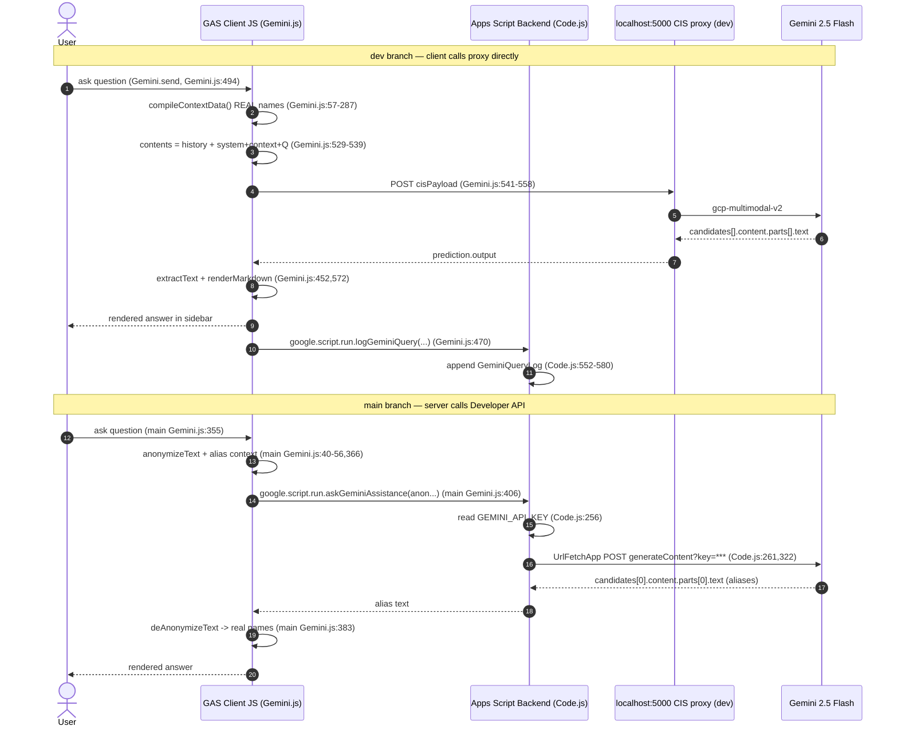

# GEMINI INTEGRATION — forecastdashboard

> Deep dive into how Gemini is wired into this GAS web app. Read-only analysis; nothing was executed.
> Label key: `[VERIFIED]` observed in code · `[INFERRED]` deduced · `[UNKNOWN]` not determinable.
> **No secrets, API keys, or tokens are reproduced anywhere in this document.**

---

## 0. TL;DR — there are TWO integrations in this repo

| | `dev` (current) | `main` (earlier) |
|---|---|---|
| Where the model is called | **Browser** (`fetch`) | **GAS server** (`UrlFetchApp`) |
| Endpoint | `http://localhost:5000/api/cis-proxy` → Workday CIS → GCP | `https://generativelanguage.googleapis.com/v1beta/models/gemini-2.5-flash:generateContent` |
| Model | `gemini-2.5-flash` (`CIS_MODEL_NAME`) | `gemini-2.5-flash` |
| Credential | none in code; proxy + VPN + feature-key header | `GEMINI_API_KEY` Script Property |
| PII | **real names sent** | **anonymized aliases**, de-anonymized client-side |
| `google.script.run` role | logging only | carries the actual prompt+context to server |
| Key files | `Gemini.js.html`, `Code.js:552` | `Code.js:255`, `Gemini.js.html` (main) |

---

## 1. Plain-English end-to-end explanation

### `dev` (client-side CIS proxy) `[VERIFIED]`
When a user opens the AI sidebar (enabled only with `?ai=1`, `Main.js:118-123`) and asks a question:

1. The browser builds a compact JSON snapshot of the **currently visible** consultants — utilization, weekly targets, availability, PTO, skills, languages, country/geo, projects, each project's Engagement Manager and leadership chain, and any active filters/rollup (`compileContextData`, `Gemini.js:57-287`).
2. The browser assembles a chat `contents[]` array: the trimmed prior turns, then one final "user" turn whose text is `SYSTEM_INSTRUCTION + context JSON + "User Question: " + prompt` (`Gemini.js:529-539`).
3. The browser POSTs a Workday-CIS-shaped payload directly to the **local** Workday AI Hub proxy at `http://localhost:5000/api/cis-proxy` (`Gemini.js:541-558`). Apps Script never sees this request — GAS servers can't reach the user's localhost (`Gemini.js:12-15`, `Code.js:545-547`).
4. The proxy forwards to Workday CIS, which routes to GCP `gemini-2.5-flash`.
5. The browser extracts the text, renders Markdown into the sidebar, updates chat history, and separately calls `google.script.run.logGeminiQuery(...)` so usage is recorded in the `GeminiQueryLog` sheet (`Gemini.js:564-583` → `Code.js:552-580`).

### `main` (server-side Developer API) `[VERIFIED]`
1. The browser builds the **same kind** of context but with **anonymized aliases** (`[[C0]]`, `[[P0]]`, `[[M0]]`, `[[D0]]`) via `getAlias` (`Gemini.js:40-56` main), and anonymizes the prompt & history (`anonymizeText`, `Gemini.js:221-227`, `buildAnonymizedHistory`, `:327`).
2. It calls `google.script.run.askGeminiAssistance(anonymizedPrompt, contextJson, historyForServer, metadata)` (`Gemini.js:406` main).
3. The server reads `GEMINI_API_KEY` from Script Properties, POSTs to the Gemini Developer API with `UrlFetchApp`, and returns the alias-only text (`Code.js:255-338` main).
4. The browser **de-anonymizes** the response (`deAnonymizeText`, `Gemini.js:229-234,383`) to restore real names for display. The alias→real-name map (`_piiMap`) never leaves the browser (`Gemini.js:53-54`).

---

## 2. Sequence diagram (Mermaid)



---

## 3. Exact files, functions, line references

| Concern | `dev` | `main` |
|---------|-------|--------|
| Entry / send | `Gemini.js:494-594` `send()` | `Gemini.js:~340-407` `send()` |
| Context builder | `Gemini.js:57-287` `compileContextData()` | `Gemini.js:61-217` `compileContextData()` |
| System instruction | `Gemini.js:22-45` `SYSTEM_INSTRUCTION` | `Code.js:263-282` `systemInstruction` |
| Request assembly | `Gemini.js:529-550` `contents`/`cisPayload` | `Code.js:284-315` `contents`/`payload`/`options` |
| Network call | `Gemini.js:412-450` `fetchWithRetry` + `:554` | `Code.js:322` `UrlFetchApp.fetch` |
| Response parse | `Gemini.js:452-463` `extractText` + `:566` | `Code.js:323-330` |
| Error handling | `Gemini.js:418-447,585-593` | `Code.js:325-334` |
| History mgmt | `Gemini.js:5-6,379-383,517-519` | `Gemini.js` (main) `trimHistory`, `buildAnonymizedHistory:327` |
| Logging | `Gemini.js:466-482` → `Code.js:552-580` | `Code.js:336` → `logGeminiQuery_` |
| PII anonymize/de-anon | **none** | `Gemini.js:40-56,221-234` |
| Credential | proxy/VPN, no key | `Code.js:256` `GEMINI_API_KEY` |

---

## 4. Authentication & credential-storage design

- **`dev`:** No credential appears in code. The browser POSTs to `http://localhost:5000/api/cis-proxy` with header `Wd-PCA-Feature-Key: 'sow-reviewer,developer-workstation'` (`Gemini.js:20,556`). Actual authentication to GCP is performed **inside the Workday AI Hub proxy / CIS**, presumably tied to the user's authenticated Workday session and VPN network position `[INFERRED]`. Availability is health-checked via `GET http://localhost:5000/api/config` (`Gemini.js:17,398`).
- **`main`:** The API key lives in **Script Properties** under the name `GEMINI_API_KEY`, read server-side at call time and appended to the URL query string (`Code.js:256,261`). It is never sent to the browser. `[VERIFIED]`

> **Credential-storage assessment:** `main`'s server-side Script Property pattern keeps the key off the client (good), though placing a key in the query string means it can appear in server-side/edge request logs (see SECURITY_REVIEW). `dev` removes app-managed key material entirely by delegating to an enterprise proxy.

---

## 5. Model name & endpoint

- Model: `gemini-2.5-flash` — `dev` `CIS_MODEL_NAME` (`Gemini.js:19`), provider `gcp` (`CIS_MODEL_PROVIDER`, `Gemini.js:18`); `main` in the URL path (`Code.js:261`). `[VERIFIED]`
- Endpoints: `dev` `http://localhost:5000/api/cis-proxy` (`Gemini.js:16`); `main` `https://generativelanguage.googleapis.com/v1beta/models/gemini-2.5-flash:generateContent` (`Code.js:261`). `[VERIFIED]`
- No Vertex AI endpoint anywhere `[VERIFIED]` (grep for `vertex` returned nothing).

---

## 6. Request-body anatomy

### `dev` CIS payload `[VERIFIED]` `Gemini.js:541-550`
```json
{
  "target": { "provider": "gcp", "model": "gemini-2.5-flash" },
  "task": {
    "type": "gcp-multimodal-v2",
    "input": {
      "contents": [ /* history turns + final user turn */ ],
      "generationConfig": { "temperature": 0.2 }
    }
  }
}
```
The final `contents` entry is a single `user` part whose text concatenates the system instruction, the context JSON, and the question (`Gemini.js:532-539`). Note: in `dev` the system instruction is **embedded in the user turn**, not a separate `systemInstruction` field.

### `main` Developer API payload `[VERIFIED]` `Code.js:302-308`
```json
{
  "systemInstruction": { "parts": [{ "text": "...Strategic Resource Manager..." }] },
  "contents": [ /* prior turns + final user turn (context + question) */ ],
  "generationConfig": { "temperature": 0.2 }
}
```
Here the system instruction uses the proper `systemInstruction` field (`Code.js:303`).

**Structured context keys** (documented inline in the system instruction, `Gemini.js:26-41` dev): `m` metadata (practice, weeks, count, active filters); `c` consultants (`id`, level `l`, staffing manager `mg`, director `dr`, utilization `u`, target `t`, skills `sk`, languages `lang`, country, geo, availability `a`, PTO `pto`, projects `pj`); each `pj` has project `p`, hours `h`, engagement manager `em`, leadership chain `lc`; optional `r` rollup block (`Gemini.js:252-276`).

**Chat history:** kept in-memory client-side, capped at `MAX_HISTORY_TURNS = 4` (×2 for user+model) via `trimHistory` (`Gemini.js:6,379-383`). Only the **current** turn carries system+context; prior turns are plain Q/A (`Gemini.js:515-517`).

**Metadata:** `practice`, `promptType` (`custom`/`suggested`), `suggestedLabel` (`Gemini.js:521-525`) — used for logging, not sent to the model.

**Generation config:** `temperature: 0.2` in both (low temperature for deterministic, grounded staffing answers). No `maxOutputTokens`, `topK`, `topP`, or safety settings are set `[VERIFIED]`.

---

## 7. Response parsing, error handling, UI rendering

- **Parse (`dev`):** `data.prediction.output || data.output || data`, then `extractText` pulls `candidates[0].content.parts[0].text`; throws a friendly error if no candidates (`Gemini.js:566,452-463`).
- **Parse (`main`):** `result.candidates[0].content.parts[0].text`; throws `result.error.message` if present (`Code.js:323-329`).
- **Retry/backoff (`dev` only):** `fetchWithRetry` handles 429 (honors `Retry-After`, else 15–60s), 5xx (exponential from 3s), and network failures, with user-visible status messages including VPN hints (`Gemini.js:412-447`).
- **Rendering:** a small hand-rolled Markdown renderer (`renderMarkdown`, `Gemini.js:291-345`) converts headings/lists/bold/italic/code to HTML injected into the sidebar (`Gemini.js:572-580`). User input is HTML-escaped before echo (`escapeHtml`, `Gemini.js:596-598`).

> **XSS note:** model output is HTML-escaped inside `renderMarkdown` (`Gemini.js:292-295`) before limited Markdown→HTML transformation, so raw model HTML is neutralized. See SECURITY_REVIEW for residual `innerHTML` considerations.

---

## 8. Context minimization & token-size considerations

- Only **visible** workers are included; `Total`/`Holiday or PTO`/`(Blank)` filtered out (`Gemini.js:65-66`).
- Week horizon capped: `MAX_WEEKS = 8` (`Gemini.js:7,62`).
- History capped: `MAX_HISTORY_TURNS = 4` (`Gemini.js:6`).
- Zero/empty fields omitted from each consultant entry to shrink JSON (`Gemini.js:150-152,217-223`).
- Hard character budget: `MAX_CHARS = 200000`; if exceeded, the consultant list is iteratively truncated to 80% and flagged `m.truncated` until under budget or ≤5 remain (`Gemini.js:228,278-284`).
- Compact single-letter keys (`m`,`c`,`u`,`t`,`sk`,`pj`…) reduce token count `[VERIFIED]` `Gemini.js:267-278`.

---

## 9. PII anonymization & de-anonymization

### `main` — full anonymization pipeline `[VERIFIED]`
- Alias maps per entity type with prefixes `[[C`, `[[P`, `[[M`, `[[D` and incrementing counters (`getAlias`, `Gemini.js:40-56`).
- Two dictionaries: `_piiMap` (alias→real) and `_reversePiiMap` (real→alias); `_piiMap` mirrored to `APP.state.piiMap` but **never sent to the server** (`Gemini.js:53-54,37`).
- `compileContextData` emits alias IDs for worker/manager/director/project (`Gemini.js:93-95,174,181-184`).
- `anonymizeText` replaces real names in the prompt & history (longest-first to avoid partial overlaps) (`Gemini.js:221-227`); `deAnonymizeText` reverses it on the response (`:229-234`).
- The system instruction commands the model to use only IDs and "NEVER guess real names" (`Code.js:280`).
- Maps reset per new context build and on `clearChat` (`Gemini.js:62,417`).

### `dev` — anonymization REMOVED `[VERIFIED]`
- No alias code exists in `dev`'s `Gemini.js`. The system instruction explicitly says: *"Use the real consultant, manager, and project names exactly as they appear in the data."* (`Gemini.js:43`).
- Real names, org relationships, utilization, PTO, and project leadership are sent verbatim to the CIS proxy.

**Implication:** the migration from `main`→`dev` traded a client-side privacy control (aliasing) for reliance on an enterprise-sanctioned AI boundary (Workday CIS). This is defensible **only** if CIS is an approved processor for this PII; it is a material data-governance decision. `[INFERRED]`

---

## 10. Logging behavior & privacy implications

`logGeminiQuery` appends a row to the `GeminiQueryLog` sheet with: timestamp, **user email**, practice, prompt type, suggested label, **full user prompt text**, context size, response length, chat turn, duration, success (`Code.js:555-576`). The client sends this after each query (`Gemini.js:470-480`).

Privacy implications:
- The **verbatim user prompt** is persisted and may contain real names / sensitive planning intent ("who can we cut").
- Rows are keyed to identifiable **user email**; combined with `SessionLog` (`Code.js:507`) and `FeatureUsageLog` (`Code.js:528`) this is a fairly complete behavioral audit trail.
- Log tabs live in the bound spreadsheet; their exposure equals the sheet's sharing. No retention limit exists for these tabs (unlike `SoftBookings`' 45-day prune, `Code.js:1379`). `[VERIFIED]`
- The **model response text is NOT stored** — only its length (`Code.js:571`), which limits leakage but also limits auditability. `[VERIFIED]`

---

## 11. Security review of THIS integration (summary; full detail in SECURITY_REVIEW.md)

| Area | `dev` | `main` |
|------|-------|--------|
| Key exposure | none in app | key server-side only (good), but in URL query string |
| PII to model | **real names** (higher risk) | aliases (lower risk) |
| Trust boundary | browser → localhost proxy (client-controlled) | browser → GAS → Google (server-mediated) |
| Prompt injection | context+question concatenated; model may act on sheet-sourced text | same, plus model told to only use IDs |
| Rate limiting | client retry only; no server throttle | none |
| Auditability | prompt + email logged; response not stored | same |

---

## 12. Clean, generic implementation blueprint (for another GAS web app)

A safe, minimal pattern that mirrors the **good** parts of both branches:

```javascript
// ---- Server (Code.gs) : keep the key + call server-side ----
function askAI(userPrompt, contextJson, history) {
  var key = PropertiesService.getScriptProperties().getProperty('GEMINI_API_KEY');
  if (!key) throw new Error('AI not configured');
  var url = 'https://generativelanguage.googleapis.com/v1beta/models/'
          + 'gemini-2.5-flash:generateContent';   // key sent via header, not query
  var payload = {
    systemInstruction: { parts: [{ text: SYSTEM_INSTRUCTION }] },
    contents: (history || []).concat([{
      role: 'user',
      parts: [{ text: 'CONTEXT:\n' + contextJson + '\n\nQUESTION: ' + userPrompt }]
    }]),
    generationConfig: { temperature: 0.2, maxOutputTokens: 1024 }
  };
  var res = UrlFetchApp.fetch(url, {
    method: 'post', contentType: 'application/json',
    headers: { 'x-goog-api-key': key },            // header keeps key out of URLs/logs
    payload: JSON.stringify(payload), muteHttpExceptions: true
  });
  var code = res.getResponseCode();
  if (code === 429 || code >= 500) throw new Error('AI temporarily unavailable');
  if (code >= 400) throw new Error('AI request rejected');
  var out = JSON.parse(res.getContentText());
  if (out.error) throw new Error('AI error');
  return (((out.candidates || [])[0] || {}).content || {}).parts ?
         out.candidates[0].content.parts[0].text : '';
}
```
```javascript
// ---- Client : minimize + (optionally) anonymize before sending ----
function send(promptText) {
  var ctx = buildMinimalContext();          // only visible rows, capped size
  google.script.run
    .withSuccessHandler(render)
    .withFailureHandler(showError)
    .askAI(promptText, ctx, trimmedHistory());
}
```

Keep server-side so: (1) the key never reaches the browser, (2) you can enforce per-user rate limits and input validation, (3) you can strip/aliasing PII centrally, and (4) `UrlFetchApp` calls are subject to your org's egress controls.

---

## 13. Two credentialing approaches (explicit guidance)

### A. Gemini Developer API + Script Property key (the `main` pattern)
- Store key as a **Script Property** (`GEMINI_API_KEY`), never in code or client (`Code.js:256`).
- Call **server-side** with `UrlFetchApp`; pass the key in the **`x-goog-api-key` header**, not the query string (the repo's `?key=` form risks log exposure, `Code.js:261`).
- Best for: prototypes, small internal tools, personal projects.
- Watch-outs: shared quota per key, no per-user identity at Google, key rotation is manual, no enterprise DLP.

### B. Enterprise Vertex AI / approved backend proxy (the spirit of `dev`)
- Route through an **approved backend service** (like the Workday CIS AI Hub proxy here) or **Vertex AI** with IAM/OAuth (service account or workload identity), not a static API key.
- With Vertex: endpoint form `https://{region}-aiplatform.googleapis.com/v1/projects/{proj}/locations/{region}/publishers/google/models/gemini-2.5-flash:generateContent`, authorized with `Authorization: Bearer <OAuth token>`.
- In GAS you would need an OAuth token for a service identity (e.g., via a service-account flow) or, as `dev` does, delegate entirely to a network-local enterprise proxy.
- Best for: production, regulated data, centralized logging/DLP, per-user attribution.
- Watch-outs (as seen in `dev`): the localhost-proxy model requires each user to run the proxy + VPN (`Gemini.js:442`), and because the call is client-side it bypasses server-side governance — so governance must live in the proxy/CIS.

> **Verified vs inferred:** endpoints, payloads, key name, temperature, PII handling, and logging fields are `[VERIFIED]` from the cited lines. The CIS proxy's internal auth and Vertex specifics are `[INFERRED]`/`[UNKNOWN]` — not present in this repo.
