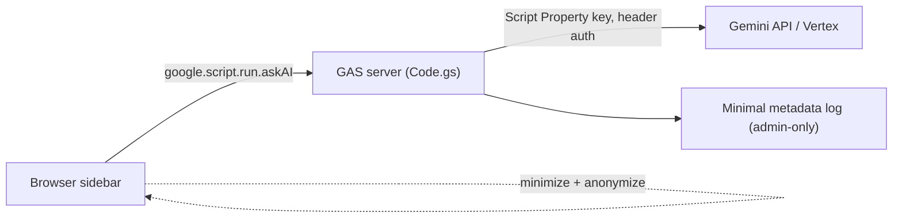

# LEARNING GUIDE — Adding Gemini to a GAS Web App (responsibly)

> Written for a Google Apps Script developer who wants to replicate the Gemini capability seen in `forecastdashboard` safely. Grounded in the actual repo (`main` = server-side + anonymized; `dev` = client-side CIS proxy + real names) but generalized. No secrets reproduced.
> Label key: `[VERIFIED]` from repo · `[INFERRED]` · `[UNKNOWN]`.

---

## 1. Concepts to understand first

1. **GAS web app basics** — `doGet(e)` returns HTML via `HtmlService`; `google.script.run` is the browser→server RPC bridge (see `Code.js:5`, `Main.js:49`).
2. **Container-bound vs standalone** — this app is bound to a Sheet and reads it with `SpreadsheetApp.getActiveSpreadsheet()` (`Code.js:313`).
3. **Where the model call lives** — the single biggest design decision:
   - **Server-side** (`UrlFetchApp` in `Code.js`, like `main`): key stays server-side, governance is enforceable.
   - **Client-side** (`fetch` in the browser, like `dev`): needed when the target is only reachable from the user's machine/VPN (e.g., a `localhost` proxy), but you lose server-side control.
4. **Credentials** — `PropertiesService.getScriptProperties()` for keys (`Code.js:256`); or delegate to an enterprise proxy / Vertex IAM (no app key).
5. **The request shape** — `contents[]` (chat turns), `systemInstruction`, `generationConfig` (`Code.js:302-308`).
6. **PII minimization & anonymization** — send only what's needed; optionally alias names (`Gemini.js:40-56` main).
7. **Prompt injection** — any data you paste into the prompt can carry instructions; treat sheet content as untrusted.
8. **Auditing & privacy** — what you log (prompt? identity? response?) has real privacy weight (`Code.js:552-576`).

---

## 2. Staged learning plan

### Stage 1 — Prototype (throwaway, personal data only)
- Use the **Gemini Developer API** with a personal key in a **Script Property** (`GEMINI_API_KEY`).
- Call it **server-side** with `UrlFetchApp`; render the text in a simple sidebar.
- Use fake/sample data — no real employee PII yet.
- Goal: understand `contents`, `systemInstruction`, `generationConfig`, and response parsing (`Code.js:284-330`).

### Stage 2 — Controlled pilot (small group, real-but-limited data)
- Add **PII minimization**: send only visible rows, cap weeks/history/size (mirror `Gemini.js:62,228,278-284`).
- Add **anonymization** if names aren't essential (port the alias map, `Gemini.js:40-56,221-234`).
- Add **server-side rate limiting** and input validation.
- Log only **non-sensitive** metadata; avoid storing verbatim prompts, or lock the log to admins.
- Confirm your org permits sending this data to the Gemini Developer API.

### Stage 3 — Production design (enterprise data)
- Move to **Vertex AI** (IAM/OAuth) or an **approved backend proxy** (the `dev` CIS pattern) so you get DLP, per-user identity, and central logging.
- Formalize data-governance sign-off for exactly which fields leave the boundary.
- Add retention/prune policies for any AI logs; add monitoring & cost caps.
- Reconcile user docs with the actual data path (avoid the drift in `REFERENCE_GUIDE.md:426,432`).

---

## 3. Minimum viable architecture



Minimum pieces: a gated sidebar (`?ai=1` like `Main.js:118-123`), a client context builder that minimizes/anonymizes, one server function holding the key and calling the model, and an admin-only, retention-bounded log.

---

## 4. Checklist for safe Gemini use in a GAS app

- [ ] Key stored in Script Properties, never in code or client (`Code.js:256`).
- [ ] Model call is server-side unless a network constraint forces client-side.
- [ ] Key sent via **header** (`x-goog-api-key`), not URL query (fix `Code.js:261`).
- [ ] Only necessary fields sent; hard size cap enforced (`Gemini.js:228,278-284`).
- [ ] Names anonymized when not required for the task (`Gemini.js:40-56`).
- [ ] Sheet-sourced text treated as untrusted; delimited/guardrailed in the prompt.
- [ ] `generationConfig` sets `temperature` and `maxOutputTokens`.
- [ ] Per-user rate limiting / cost cap present.
- [ ] Logs exclude verbatim prompts (or are admin-only + pruned).
- [ ] Model output escaped before rendering; avoid raw `innerHTML` sinks.
- [ ] `setXFrameOptionsMode` scoped, not `ALLOWALL`, unless embedding is required (`Code.js:11`).
- [ ] Data-governance approval obtained for the chosen AI boundary.
- [ ] User documentation matches the real data path.

---

## 5. Common mistakes to avoid (all observed or implied in this repo)

1. **Sending real PII without approval** — `dev` sends real names (`Gemini.js:43`); ensure the processor is sanctioned.
2. **Bypassing the server so no policy can apply** — client-side calls (`Gemini.js:541-558`) can't be governed by GAS.
3. **Logging full prompts + identity forever** — (`Code.js:566,570`) with no TTL.
4. **Key in the URL** — (`Code.js:261`).
5. **No output token cap / throttle** — (`Gemini.js:547`).
6. **Ignoring prompt injection from data** — concatenating sheet values into prompts (`Gemini.js:532-539`).
7. **Docs drifting from code** — (`REFERENCE_GUIDE.md:426,432`).
8. **Committing `scriptId`/config** — (`.clasp.json`).

---

## 6. Generic code-flow outline (no secrets)

```text
CLIENT (sidebar)
  onSend(q):
    ctx = buildContext(visibleRowsOnly, capWeeks, capSize)   // minimize
    ctx = anonymize(ctx)                                      // optional
    google.script.run.withSuccessHandler(render)
                     .withFailureHandler(showError)
                     .askAI(q, ctx, trimmedHistory)

SERVER (Code.gs)
  askAI(q, ctx, history):
    key = ScriptProperties.get('GEMINI_API_KEY')  // never to client
    enforceRateLimit(getActiveUserEmail())
    body = { systemInstruction, contents: history + [userTurn(ctx, q)],
             generationConfig: { temperature: 0.2, maxOutputTokens: 1024 } }
    res  = UrlFetchApp.fetch(endpoint, { headers:{ 'x-goog-api-key': key },
                                         payload: JSON(body), muteHttpExceptions:true })
    handleStatus(res)                              // 429/5xx/4xx -> friendly errors
    text = res.candidates[0].content.parts[0].text
    logMetadataOnly(getActiveUserEmail(), sizeOf(ctx), len(text))  // no verbatim prompt
    return text

CLIENT
  render(text): deAnonymize(text); escape; markdownToDom(); append
```

---

## 7. Decision guidance: direct GAS→Gemini vs enterprise proxy/service

| Choose **direct server-side GAS → Gemini Developer API** when… | Choose **enterprise Vertex AI / approved proxy** when… |
|---|---|
| Internal tool, non-regulated / low-sensitivity data | Employee/customer PII or regulated data |
| Small user base, simple quota needs | Need per-user identity, DLP, central audit |
| You accept a single shared API key | You need IAM/OAuth, key-less service identity |
| Fast prototyping | Production, compliance sign-off required |
| The endpoint is reachable from Google's servers | The endpoint is only reachable via VPN/localhost (forces client-side, like `dev`) |

This repo shows both poles: `main` = direct server-side Developer API (with anonymization as a compensating control); `dev` = enterprise proxy (Workday CIS) but client-side and without anonymization — illustrating the trade-off that an enterprise boundary can tempt teams to drop other controls. Aim for **enterprise boundary + minimization + server governance** together.

---

## 8. Glossary

| Term | Meaning (as used here) |
|------|------------------------|
| **GAS** | Google Apps Script; JS runtime hosting server code + HTML service |
| **Container-bound** | Script attached to a specific Sheet/Doc; can read it directly |
| **`doGet(e)`** | Web-app HTTP entry point returning HTML (`Code.js:5`) |
| **`google.script.run`** | Async browser→server RPC (`Main.js:49`) |
| **`HtmlService` template / `include`** | Server-side HTML composition (`Code.js:34`, `Index.html:921`) |
| **`PropertiesService`** | Key/value store for config/secrets (`Code.js:256`) |
| **`UrlFetchApp`** | Server-side HTTP client (needs external-request scope) (`Code.js:322,878`) |
| **`CacheService`** | Short-lived server cache; used for staffing data (`Code.js:42`) |
| **`Session.getActiveUser()`** | Current user identity (`Code.js:368`) |
| **`executeAs` / `access`** | Deployment identity & audience (`USER_DEPLOYING`/`USER_ACCESSING`, `DOMAIN`) |
| **`systemInstruction`** | Model role/rules field (`Code.js:303`) |
| **`contents[]`** | Ordered chat turns sent to Gemini (`Code.js:284-300`) |
| **`generationConfig`** | Sampling params like `temperature` (`Code.js:305`) |
| **Gemini Developer API** | `generativelanguage.googleapis.com`, key-based (`Code.js:261`) |
| **Vertex AI** | Enterprise Google AI platform, IAM/OAuth (not used in repo) |
| **CIS AI Hub proxy** | Workday local proxy at `localhost:5000` fronting Gemini (`Gemini.js:16`) |
| **Anonymization / de-anonymization** | Alias real names before send; restore on response (`Gemini.js:40-56,221-234` main) |
| **Prompt injection** | Untrusted text steering the model against intent |
| **`gemini-2.5-flash`** | The model used (`Gemini.js:19`, `Code.js:261`) |

---

## 9. Next steps — a safe proof of concept (separate GAS project)

1. Create a **new, empty** standalone GAS project (do not touch `forecastdashboard`).
2. Add a Script Property `GEMINI_API_KEY` (your own dev key); never commit it.
3. Write one server function `askAI(prompt)` that calls the Developer API server-side with header auth, `temperature: 0.2`, `maxOutputTokens` set.
4. Add a minimal sidebar that sends a prompt and renders escaped output.
5. Feed it **synthetic** data only; verify parsing and error handling (429/5xx).
6. Add metadata-only logging (no verbatim prompt).
7. Only after governance sign-off, graduate to real data — and prefer an approved enterprise boundary (Vertex/proxy) with minimization + anonymization retained.

> Everything above generalizes the repo's patterns; endpoints/model/temperature/PII/logging specifics are `[VERIFIED]` at the cited lines. CIS-proxy internals and any Vertex specifics are `[UNKNOWN]` from this repo.
