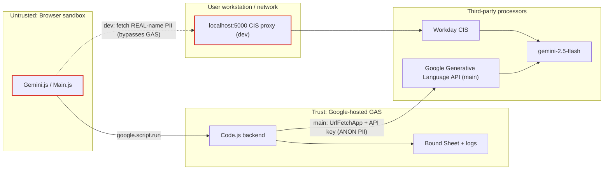

# SECURITY REVIEW — forecastdashboard

> Static, read-only security assessment. No code was executed, changed, or deployed. No secret values are reproduced.
> Severity scale: **Critical / High / Medium / Low / Informational**. Every finding cites file:line.
> Label key: `[VERIFIED]` observed · `[INFERRED]` deduced · `[UNKNOWN]` not determinable.

---

## 1. Threat Model

**System.** A DOMAIN-restricted GAS web app that surfaces consulting staffing data (names, org chart, utilization, PTO, project assignments) from Google Sheets and sends a snapshot to Gemini for natural-language analysis. Two designs coexist (`dev` client-side CIS proxy; `main` server-side Developer API).

**Actors.**
- Legitimate domain users (intended).
- A curious/over-privileged domain user (can they see others' data or logs?).
- A malicious data contributor who can edit the source spreadsheet (prompt-injection via data).
- An attacker on the user's workstation/network (localhost proxy in `dev`).
- Google / Workday CIS / GCP as data processors.

**Primary threats.** Credential leakage; over-broad data egress to AI; PII exposure; prompt injection from sheet-sourced content; log/audit exposure of prompts + identities; web-app deployment/sharing misconfiguration; documentation drift causing wrong assumptions.

---

## 2. Assets to Protect

| Asset | Where | Evidence |
|-------|-------|----------|
| AI credential | `main` Script Property `GEMINI_API_KEY` | `Code.js:256` |
| `scriptId` | `.clasp.json` (dev) | `.clasp.json` |
| Sheet data (names, util, PTO, org, projects) | bound spreadsheet + IMPORTRANGE source | `Code.js:312-370` |
| User identity | `Session.getActiveUser().getEmail()` in every log | `Code.js:368,464,511,560,597` |
| PII sent to model | context JSON, prompt | `Gemini.js:57-287,532-539` |
| Model prompts + responses | prompt persisted; response length only | `Code.js:552-576` |
| Audit logs | `GeminiQueryLog`, `SessionLog`, `FeatureUsageLog`, `PerfLog`, `AppUsageAnalytics` | `Code.js:463,510,531,559,595` |
| Deployment settings | `appsscript.json` | manifest |

---

## 3. Trust-Boundary Diagram (Mermaid)

Key boundary observations:
- **`dev`**: PII crosses from the untrusted browser straight to a client-controlled localhost proxy — **the GAS server is not in the loop**, so no server-side policy can apply (`Gemini.js:541-558`; rationale `Code.js:545-547`).
- **`main`**: PII crosses browser→GAS→Google, with anonymization applied in the browser before it leaves (`Gemini.js:366,406` main).

---

## 4. Findings

### F-1 [High] — Real PII sent to AI with anonymization removed in `dev`
`dev` sends real consultant/manager/director/project names plus utilization, PTO, and org chain to the AI, and the system instruction explicitly instructs the model to use real names (`Gemini.js:43`, context build `Gemini.js:85-86,181-207`). The `main` branch had a full client-side alias pipeline (`Gemini.js:40-56,221-234` main) that was **dropped**. Unless Workday CIS is a contractually approved processor for this employee PII, this is a data-governance regression.
- Evidence: `Gemini.js:43` (dev), vs `Code.js:280` + `Gemini.js:40-56` (main).
- Risk: employee PII exposure to an AI processing path; potential HR/data-privacy policy violation.

### F-2 [High] — AI call bypasses the server; no server-side governance possible in `dev`
The model request is a **browser** `fetch` to `localhost:5000` (`Gemini.js:541-558`), so Apps Script cannot enforce authorization, rate limiting, input validation, redaction, or complete audit of what was sent. Any control must live in the CIS proxy (out of repo scope).
- Evidence: `Gemini.js:16,541-558`; design note `Code.js:545-547`.
- Risk: no enforceable server-side policy; client code (and thus the payload) is fully user-modifiable.

### F-3 [High] — Verbatim prompts + user identity logged without retention limit
`GeminiQueryLog` stores the full user prompt text and user email per query (`Code.js:566,570`), joined by `SessionLog`/`FeatureUsageLog` into a rich behavioral profile. There is no TTL/prune for these tabs (contrast `SoftBookings` 45-day prune `Code.js:1379`). Anyone with read access to the bound sheet can read all users' prompts.
- Evidence: `Code.js:552-576,507-521,528-539`.
- Risk: sensitive intent (e.g., "who to cut") + identity retained indefinitely; insider exposure.

### F-4 [Medium] — API key placed in URL query string (`main`)
The Developer API key is concatenated into the request URL `...:generateContent?key=` (`Code.js:261`). Query-string secrets are more likely to surface in proxy/edge/error logs than header-based auth.
- Evidence: `Code.js:261`.
- Remediation: use the `x-goog-api-key` header instead.

### F-5 [Medium] — Prompt injection from spreadsheet-sourced content
Context is built from sheet data (project names, notes-adjacent fields, org names) and concatenated with the system instruction and user question into one prompt (`Gemini.js:532-539`). A malicious editor of the source sheet could embed instructions (e.g., a crafted "project name") that the model may follow. No input sanitization or delimiter hardening is applied to sheet values.
- Evidence: `Gemini.js:158-207,532-539`.
- Risk: manipulated AI output / instruction override; higher impact because output is shown to decision-makers.

### F-6 [Medium] — `scriptId` committed in `.clasp.json`
The deploy `scriptId` is tracked in the repo (`.clasp.json`, dev). While not a secret credential, it identifies the exact script project and aids targeting.
- Evidence: `.clasp.json` (value intentionally not reproduced here).
- Remediation: treat as sensitive; consider gitignoring `.clasp.json` and distributing out-of-band.

### F-7 [Medium] — `setXFrameOptionsMode(ALLOWALL)` on all served pages
All `doGet` responses disable frame protection (`Code.js:11,17,22`). This allows embedding in arbitrary sites, enabling clickjacking/UI-redress against an authenticated user.
- Evidence: `Code.js:11,17,22`.
- Remediation: restrict framing to known hosts if embedding is required; otherwise remove `ALLOWALL`.

### F-8 [Medium] — Ownership-transfer of exported files to arbitrary domain emails
Exports add the requesting user as editor and attempt `file.setOwner(userEmail)` using an email derived from session (`Code.js:842-849,931-936`). If the email source were ever influenced by client input, this could mis-share; currently it is from `Session.getActiveUser()` `[VERIFIED]` so risk is limited, but the pattern is sensitive.
- Evidence: `Code.js:832-856,927-940`.

### F-9 [Low] — No `maxOutputTokens` / cost & abuse controls
Neither path sets output caps or per-user throttles (`Gemini.js:547`, `Code.js:305-307`). Combined with F-2, a user can drive unbounded AI usage/cost.
- Evidence: `Gemini.js:547`, `Code.js:305-307`.

### F-10 [Low] — Client-side Markdown to `innerHTML`
Model output is escaped then transformed and written via `innerHTML` (`Gemini.js:292-295,572-580`). Escaping first mitigates script injection, but the regex-based transformer + `innerHTML` sink is fragile; a renderer bug could reintroduce XSS.
- Evidence: `Gemini.js:291-345,572-580`.

### F-11 [Low] — Diagnostic functions expose row-level data
`debugShieldRow`, `debugSourceShield` (hard-codes a search for "jasmine"), `getTechSheetDiag` return raw row samples (`Code.js:122,230,287,427`). These are callable if exposed via `google.script.run` and leak source data structure/content.
- Evidence: `Code.js:122-158,230-310,427-440`.

### F-12 [Informational] — Documentation drift misstates the security posture
`REFERENCE_GUIDE.md:426,432` claims an API key is required and the AI receives an "anonymized snapshot" — true for `main`, false for `dev`. Operators may wrongly assume PII is anonymized.
- Evidence: `REFERENCE_GUIDE.md:426,432` vs `Gemini.js:43`.

### F-13 [Informational] — Multiple branches with divergent security models
`main` (anon/server) and `dev` (real/client) differ fundamentally; `master` is near-empty. Ambiguity about what is deployed is itself a risk.
- Evidence: `git ls-tree` of `main`/`dev`/`master`.

---

## 5. Focused Assessments

### API-key handling
- `dev`: no app-managed key — strongest posture for key leakage, but shifts all trust to the CIS proxy (F-2). `[VERIFIED]`
- `main`: key in Script Properties (correct storage) but injected via URL query (F-4). Never sent to client. `[VERIFIED]` `Code.js:256,261`.

### Browser / server trust boundary
- `dev` collapses the boundary for AI calls: the browser is the AI client (F-2). Everything the client sends is attacker-modifiable.
- `main` preserves a server checkpoint but performs no validation/throttling there.

### Prompt injection & untrusted input
- Sheet-sourced strings flow unsanitized into the prompt (F-5). `main`'s "use only IDs" instruction is a weak mitigation and is absent in `dev`.

### PII anonymization limitations
- Even `main`'s aliasing is reversible client-side and only masks names, not structural PII (org shape, utilization patterns) that can re-identify individuals in a small consulting practice. `dev` removes masking entirely (F-1).

### Logging, retention, access control
- Prompts + identity persisted without TTL (F-3). Log tabs inherit the spreadsheet's sharing; no evidence of restricted-tab protection. `[VERIFIED]` `Code.js:552-576`.

### GAS web-app deployment & sharing
- `access: DOMAIN` limits to the org (good). `dev` `executeAs USER_DEPLOYING` runs as owner — broad owner-scope Drive/Sheet actions on behalf of any domain user; `main` `USER_ACCESSING`. `ALLOWALL` framing (F-7). `[VERIFIED]` manifests, `Code.js:11`.

### Dependency & configuration risks
- Sheets Advanced Service required (dev). No third-party JS libraries observed. `scriptId` committed (F-6). Docker/VPN operational dependency for `dev` AI (`Gemini.js:442`).

---

## 6. Prioritized Remediation Plan

| # | Priority | Action | Refs |
|---|----------|--------|------|
| 1 | **High** | Confirm Workday CIS is an approved processor for employee PII; if not, restore anonymization (port `main`'s alias pipeline) before sending to any AI. | F-1 |
| 2 | **High** | Re-introduce a server-mediated (or proxy-enforced) checkpoint so authorization, rate-limit, redaction, and full audit are enforceable; don't rely solely on client code. | F-2, F-9 |
| 3 | **High** | Stop logging verbatim prompts, or restrict the log tab to admins and add a retention/prune policy; consider hashing/redacting prompts. | F-3 |
| 4 | **Medium** | Move the Developer API key to the `x-goog-api-key` header (never query string); rotate if it was ever in a URL/log. | F-4 |
| 5 | **Medium** | Sanitize/delimit sheet-sourced text in prompts; add explicit "treat data as untrusted" guardrails; keep the "IDs only" instruction. | F-5 |
| 6 | **Medium** | Gitignore/rotate `scriptId`; remove `ALLOWALL` or scope framing to trusted hosts. | F-6, F-7 |
| 7 | **Low** | Add `maxOutputTokens` and per-user throttling; harden Markdown rendering (prefer `textContent`/DOM building). | F-9, F-10 |
| 8 | **Low** | Remove or lock down `debug*` functions in production. | F-11 |
| 9 | **Info** | Reconcile `REFERENCE_GUIDE.md` with the deployed design; clarify which branch is production. | F-12, F-13 |

---

## 7. Notes on Method / Redaction

- All findings derive from static reading of tracked files across `dev` and `main`. No app code was run.
- Secret values were **not** opened, copied, or printed. Only the **name** `GEMINI_API_KEY` and the **location** of the `scriptId` are referenced; their values are redacted by design.
